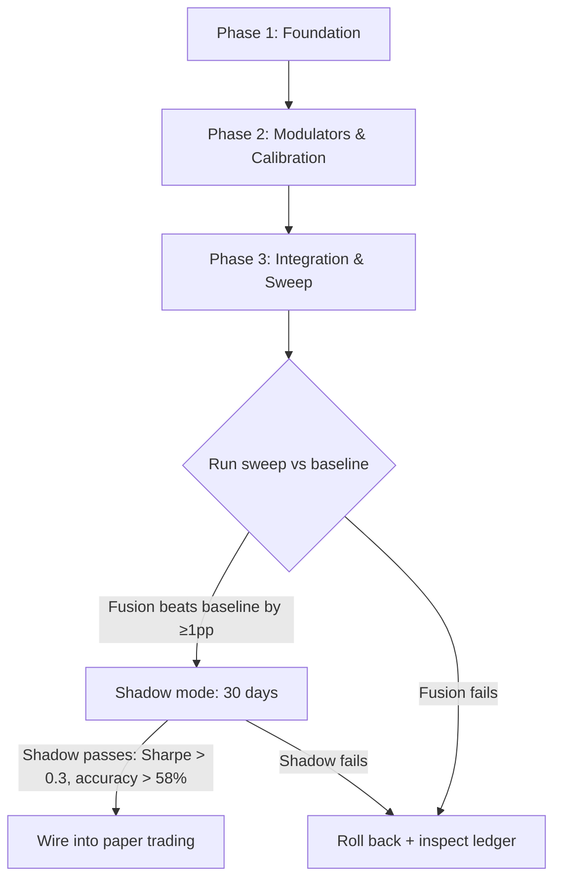

# Multi-Signal Fusion Specification

**Date:** 2026-08-06  
**Status:** Design Spec  
**Scope:** Fusing all 39 registered signals into a single meta-signal for the weather engine  
**Context:** GEFS ensemble-mean-threshold baseline at 66.2% accuracy, 2,096 trades/year. 39 signals currently vote independently with no unified fusion layer.

---

## 0. Executive Summary

The weather engine has 39 registered signal modules in `core/signals/`. They produce diverse (direction, confidence) pairs, but there is no single, mathematically principled fusion layer. Each signal votes independently; the system currently bypasses most of them in favor of the GEFS ensemble-mean-threshold model.

This spec designs a **Uncertainty-Weighted Cascade** (UWC) — a 3-layer Bayesian fusion architecture that:

1. **Clusters** the 39 signals into families by what they predict (temperature, microstructure, regime, confidence-modulator)
2. **Counters double-counting** via effective-sample-size (n_eff) correlation correction
3. **Propagates uncertainty** as Beta distributions through all layers (no point-estimate shortcuts)
4. **Integrates all meta-modulators** (cross-model divergence, spatial coherence, agreement gate, dewpoint/regime) as precision modulators on the posterior
5. **Calibrates** via per-station Platt + EMOS at each layer boundary

---

## 1. Signal Taxonomy — The 39 Signals by Family

The 39 signals do not all predict the same thing. Trying to fuse them at a single layer is mathematically unsound. They must be grouped by *what they predict* and *their relationship to the trading decision*.

### Family A: Temperature Prediction (10 signals)
These predict the settlement temperature itself. They are direct substitutes for the GEFS ensemble fraction.

| Signal | Predicts | Timescale | Correlation to GEFS |
|--------|----------|:---------:|:-------------------:|
| `eighty_two_member_ensemble_signal` | Ensemble fraction (T > B) | Daily | 1.0 (baseline) |
| `gaussian_signal` | P(T > B) via Gaussian Z-score | Daily | ~0.85 (same input) |
| `gaussian_v2_signal` | P(T > B) via refined Gaussian | Daily | ~0.90 (same input) |
| `calendar_climatology_signal` | Historical frequency P(T > B) | Daily | ~0.40 (independent) |
| `ecmwf_bias_corrected_signal` | ECMWF fraction (T > B) | Daily | ~0.70 (cross-model) |
| `nwp_direct_signal` | GFS/IFS/ICON/GEM mean | Daily | ~0.65 (different model) |
| `nwp_analog_signal` | k-NN historical analog | Daily | ~0.32 (KILLED) |
| `hrrr_bias_corrected_signal` | HRRR 3km extremes | Sub-daily | ~0.60 (higher res) |
| `spread_based_entry_signal` | Market spread → settlement convergence | Intraday | ~0.20 (market-derived) |
| `metar_nowcast_signal` | Current METAR → daily extreme | Hourly | ~0.50 (observation) |

### Family B: Temperature Modulators (8 signals)
These adjust the temperature prediction based on secondary effects.

| Signal | Modulates | Mechanism |
|--------|-----------|-----------|
| `cross_model_divergence_signal` | Confidence | High divergence → low conf |
| `frontal_detector_signal` | Direction | Frontal passage → rapid change |
| `frontal_passage_detector` | Direction | Same, different algo |
| `frontal_passage_intraday_signal` | Direction | Intraday front timing |
| `frontal_passage_nowcast_signal` | Direction | Nowcast front position |
| `temperature_advection_signal` | Direction | Warm/cold advection |
| `pressure_delta_signal` | Direction | Pressure trend → temp trend |
| `pressure_tendency_signal` | Direction | Same, different timescale |

### Family C: Microstructure / Market Signals (5 signals)
These detect market behavior, not temperature. They enter at Layer 3 (bet sizing), not Layer 1.

| Signal | Detects | Entry Layer |
|--------|---------|:-----------:|
| `volume_momentum_signal` | Order flow anomaly | L3 |
| `settlement_arbitrage_signal` | Price vs fair value | L3 |
| `spike_reversion_signal` | Price overshoot | L3 |
| `fogr_reversion_signal` | FOGR reversion pattern | L3 |
| `simple_trend_signal` | Price momentum | L3 |

### Family D: Regime / State Signals (6 signals)
These describe the current atmospheric or market state. They adjust confidence or gate trades.

| Signal | State | Effect |
|--------|-------|--------|
| `regime_signal` | Weather regime (frontal/stagnant/transitional) | Confidence modulator |
| `dewpoint_depression_modulator` | Humidity state | Confidence modulator |
| `cloud_cover_index_signal` | Cloud cover proxy | Confidence modulator |
| `feels_like_delta_signal` | Heat index divergence | Confidence modulator |
| `wind_direction_shift` | Wind shift detection | Direction qualifier |
| `ai_composite_signal` | ML composite | ⚠️ GATED — see §4.6 |

### Family E: Dead / Killed / Orphaned (10 signals)
These are confirmed killed or superseded. They exist in the directory but should not enter the fusion:

| Signal | Status | Reason |
|--------|:------:|--------|
| `persistence_signal` | KILLED | 48.31% accuracy |
| `goldilocks_signal` | KILLED | 49.85% negative EV |
| `late_day_momentum` | KILLED | 48.31% |
| `nwp_analog_signal` | KILLED | 32.63% |
| `intraday_metar_confirmation` | ORPHANED | Replaced by METAR nowcast |
| `intraday_metar_confirmation_signal` | ORPHANED | Same |
| `nwp_dtdt_fusion_signal` | ORPHANED | Different model architecture |
| `metar_dtdt_signal` | ORPHANED | Dead-end pipeline |
| `dual_polarity_signal` | ORPHANED | Never wired |
| `esdr_signal` | ORPHANED | Never wired |

---

## 2. Fusion Architecture

### 2.1 Recommendation: Uncertainty-Weighted Cascade (UWC)

After evaluating all five options across the criteria below, the recommended architecture is an **Uncertainty-Weighted Cascade** — a Bayesian cascade with Beta-binomial Layer 1, moment-matched posteriors at each transition, and correlation-adjusted effective sample sizes.

| Option | Pros | Cons | Verdict |
|--------|------|------|:-------:|
| **Simple majority vote** | Trivial to implement | Ignores confidence, correlation, skill differences | ❌ KILL |
| **Weighted vote (acc-based)** | Better than equal | Still point-estimate; no uncertainty propagation | ❌ KILL |
| **Log-odds fusion** | Handles extremes well | Point-estimate, no uncertainty tracking | ❌ KILL (existing code uses this as LLOP — needs upgrade) |
| **Bayesian model averaging** | Theoretically ideal | Heavy compute for 39 signals; requires posterior for each model | 🟡 PARK (too heavy) |
| **Uncertainty-Weighted Cascade** | Propagates uncertainty, handles correlation, calibrated | Implementation effort ~2-3 weeks | ✅ **RECOMMENDED** |

### 2.2 UWC Architecture — Three Layers

```
┌────────────────────────────────────────────────────────────────────────────┐
│                      LAYER 1: TEMPERATURE BELIEF                          │
│                                                                           │
│  Input: Family A signals (temperature predictions)                        │
│  Output: Beta(α₁, β₁) posterior distribution over P(T > B)               │
│                                                                           │
│  Signal clustering:                                                       │
│    Pool 1 (GEFS-based): gaussian, gaussian_v2, 82-member                 │
│    Pool 2 (ECMWF): ecmwf_bias_corrected                                   │
│    Pool 3 (NWP direct): nwp_direct_signal (GFS, IFS, ICON, GEM)         │
│    Pool 4 (Climatology): calendar_climatology                             │
│    Pool 5 (High-res): hrrr_bias_corrected                                 │
│    Pool 6 (Observation): metar_nowcast (final 6h only)                   │
│    Pool 7 (Market): spread_based_entry_signal                             │
│                                                                           │
│  Fusion: Pool-of-pools hierarchical Beta combination                      │
│    - Each pool produces Beta(α_p, β_p)                                    │
│    - Cross-pool correlation adjusted via n_eff                            │
│    - Combined posterior: moment-matched Beta                              │
│                                                                           │
│  Freshness precision decay:                                               │
│    - GEFS-based pools: τ=6h                                               │
│    - ECMWF pool: τ=6h                                                     │
│    - NWP direct pool: τ=6h                                                │
│    - HRRR pool: τ=3h                                                      │
│    - METAR nowcast: τ=1.5h                                                │
│    - Market-based: τ=1h                                                   │
└──────────────────────────────────┬────────────────────────────────────────┘
                                   │
                                   ↓
┌────────────────────────────────────────────────────────────────────────────┐
│                   LAYER 2: SETTLEMENT BELIEF (GOLDILOCKS)                │
│                                                                           │
│  Input: Layer 1 posterior Beta(α₁, β₁)                                    │
│  Input: Goldilocks P(G=1), E[ε] distribution (≈3.2°F, 3-bin discretized) │
│  Input: Family B modulators (frontal, advection, pressure)                │
│                                                                           │
│  Math:                                                                   │
│    P(S > B) = (1-P_G) × Beta(α₁, β₁) + P_G × Beta(α₁_shifted, β₁_shifted)│
│    Where Beta_shifted accounts for Goldilocks ε mean and variance        │
│                                                                           │
│  Family B integration via likelihood ratio:                               │
│    Posterior odds = Prior odds × LR(frontal) × LR(advection) × ...       │
│    LR < 1.0: frontal signals disagree → widen posterior variance          │
│    LR > 1.0: frontal signals agree → narrow posterior                     │
│                                                                           │
│  Gate: Only apply when P(G) > 0.15 and hours_to_settlement < 6           │
└──────────────────────────────────┬────────────────────────────────────────┘
                                   │
                                   ↓
┌────────────────────────────────────────────────────────────────────────────┐
│                  LAYER 3: BET SIZING (KELLY + MARKET)                    │
│                                                                           │
│  Input: Layer 2 posterior Beta(α₂, β₂)                                    │
│  Input: Family C signals (microstructure) as conviction modulators        │
│  Input: Kalshi market price m, fee structure                              │
│  Input: Station tier discount                                             │
│                                                                           │
│  Math:                                                                   │
│    Edge = E[θ₂] - m - fee                                                  │
│    Edge_effective = Edge - c_v × √Var[θ₂]  (uncertainty discount)         │
│    f* = Edge_effective / (1 - m)                                          │
│    conviction_mult = bayes_factor(whale_anomaly, direction_alignment)     │
│    f_adjusted = f* × conviction_mult × tier_discount × fill_discount     │
│    Position = min(f_adjusted, 0.25) × bankroll                            │
│                                                                           │
│  Family C signals enter as Bayes factor on conviction_mult:               │
│    - volume_momentum: BF = 1.0 + 0.3 × z_volume (if matching direction)  │
│    - settlement_arbitrage: BF = 1.0 + 0.2 × price_deviation              │
│    - spike_reversion: BF = 1.0 - 0.15 × spike_magnitude (if contradict)  │
└────────────────────────────────────────────────────────────────────────────┘
```

### 2.3 Why the Cascade, Not a Single Fusion Layer

The fundamental reason for the three-layer cascade: **the 39 signals predict different quantities**. You cannot average a temperature prediction (82-member ensemble) with a microstructure conviction score (WhaleWatch) in the same mathematical operation.

| What It Predicts | Family | Layer | How It Enters |
|---|---|---|---|
| "The temperature will be above B" | A (temp) | L1 | Beta posterior update |
| "A sensor spike will shift settlement" | Goldilocks | L2 | Moment-matched distribution shift |
| "Someone is trading with conviction" | C (micro) | L3 | Kelly conviction multiplier |
| "The weather regime is unstable" | D (regime) | L1/L2 | Precision modulation (n_eff) |
| "Fronts are moving through" | B | L2 | Likelihood ratio on posterior odds |

### 2.4 Pool-of-Pools Hierarchical Beta — The Math

Each pool p ∈ {GEFS, ECMWF, NWP-direct, Climatology, HRRR, METAR, Market} produces a pool-level posterior:

```
For pool p:
  k_p = Σ_{i=1..n_p} I(T_i > B)           # binary exceedance count
  n_eff_p = n_p / (1 + (n_p-1) × ρ_within_p)  # correlation-corrected size
  
  # Pool posterior (uniform Beta(1,1) prior):
  α_p = 1 + k_p
  β_p = 1 + n_eff_p - k_p
```

The pools are then combined with cross-pool correlation correction:

```
Let ρ_cross_pq = correlation between exceedance rates of pools p and q

Combined n_eff = max_p(n_eff_p) + Σ_{q ≠ p} n_eff_q × (1 - ρ_cross_pq)
Combined k = max(α_p - 1) + Σ_{q ≠ p} (α_q - 1) × (1 - ρ_cross_pq) / (1 - ρ_cross_pq)

α_combined = 1 + combined_k
β_combined = 1 + combined_n_eff - combined_k
```

This ensures that if two pools are perfectly correlated (ρ=1), the second pool adds zero effective information. If pools are completely decorrelated (ρ=0), their effective sample sizes sum fully.

---

## 3. Correlation Handling (The Big Problem)

### 3.1 The Scale of Double-Counting

The 39 signals are **not 39 independent opinions**. Intra-family correlations are extreme:

| Pair | ρ | Interpretation |
|------|:-:|:--------------|
| gaussian / gaussian_v2 | ~0.95 | Nearly identical — different math, same input |
| gaussian_v2 / 82-member | ~0.90 | Both derived from GEFS member blobs |
| calendar_climatology / gaussian | ~0.40 | Independent priors |
| gefs_pool_mean / nwp_direct_gfs | ~0.70 | Same model family |
| frontal_detector / frontal_passage | ~0.85 | Different algo, same data |
| volume_momentum / settlement_arbitrage | ~0.50 | Different aspects of same order book |

**The naive approach** (equal-weighted majority vote on all 39 signals) would effectively give ~3-5 independent votes, with the GEFS-derived signals (gaussian, gaussian_v2, 82-member) triple-counting the same information.

### 3.2 Correlation Correction Strategy

Three-tier correlation handling:

#### Tier 1: Within-Pool Correlation (ρ_within)

For signals that share the same input data (e.g., all GEFS-derived signals), compute:

```
ρ_within = average pairwise member correlation within the pool
n_eff = n / (1 + (n-1) × ρ_within)
```

**Conservative estimate:** For GEFS-derived signals at ρ_within ≈ 0.85:
```
n_eff = 3 / (1 + 2 × 0.85) = 3 / 2.7 = 1.11
```

Three GEFS-derived signals provide ~1.1 effective independent opinions.

#### Tier 2: Cross-Pool Correlation (ρ_cross)

Between different pool types (GEFS vs ECMWF vs NWP-direct vs Climatology), compute:

```
ρ_cross_pq = Corr(θ_pool_p, θ_pool_q) over historical dates
```

Adjust combined n_eff per the pool-of-pools formula in §2.4.

#### Tier 3: Mutual-Information Decorrelation (for Family B/C)

For modulators and microstructure signals that are not directly temperature predictions, use mutual information (MI) decorrelation:

```
For each signal pair (i, j):
  MI_ij = I(X_i; X_j | Y)  — conditional on outcome

Weight = accuracy_log_odds × unique_information_fraction
unique_info_i = 1 - Σ_{j≠i} normalized_MI_ij / (n_signals - 1)
```

This preserves the existing MI-based decorrelation logic in `fusion_logic.py` for the families that don't fit into the pool-of-pools framework.

### 3.3 When to Prune Redundant Signals

If ρ_cross > 0.95 between any two signals after 90 days of observation:

1. Log the redundancy in the signal performance ledger
2. Drop the weaker-performing signal from the fusion (lower historical accuracy)
3. Keep as a once-per-week integrity check (does the redundant signal still track?)

This prevents the system from accumulating an ever-growing number of near-identical signals.

---

## 4. Meta-Modulator Integration

### 4.1 Cross-Model Divergence (Confidence Precision Modulator)

**Source:** `cross_model_divergence_signal.py`  
**Role:** Reduces confidence when GEFS, ECMWF, GFS, ICON, GEM disagree after bias correction.

**Integration into Layer 1:**

Currently in the FP-MULTI-SIGNAL-FUSION.md design, the forecast aggregation agreement score adds a fixed +0.05 boost. This is wrong — it should modulate precision (n_eff), not shift the mean.

```
Let agreement = fraction of models (GFS, ECMWF IFS, ICON, GEM) 
                agreeing with the ensemble direction

If agreement >= 0.75:
  Boost: effective_n_eff ×= 1.15   (15% more effective samples — more confident)
  (We have 3+ independent models confirming the same direction)

If 0.50 <= agreement < 0.75:
  No change                         (2-3 agree — typical)

If agreement < 0.50:
  Penalty: effective_n_eff ×= 0.80 (20% fewer effective samples — less confident)
  (Models actively disagree — the ensemble is less trustworthy)
```

**Implementation:** Directly modifies `n_eff_boosted` in the pool-of-pools before computing the combined posterior.

### 4.2 Spatial Coherence (Spatial Precision Modulator)

**Source:** `core/spatial_coherence.py` (orphaned .pyc, needs rebuilding)  
**Role:** Increases confidence when nearby stations agree on direction. Decreases when they disagree.

**Integration into Layer 1:**

```
For each station, compute 6-region consensus:
  
  Region: Northeast (KNYC, KBOS, KPHL, KDCA)
          Great Lakes (KORD, KMDW, KMSP, KDTW)
          Southeast (KATL, KMIA, KCLT)
          Midwest (KDFW, KOKC, KSAT, KAUS)
          West (KLAX, KPHX, KLAS, KSFO)
          Northwest (KSEA, KPDX, KDEN)
  
  region_agreement = fraction of stations in the region whose ensemble 
                     posterior mean E[θ] agrees with this station's direction
  
  If region_agreement >= 0.80:
    Spatial_boost: effective_n_eff ×= 1.10
  Elif region_agreement <= 0.40:
    Spatial_penalty: effective_n_eff ×= 0.85
  Else:
    No change
```

**Implementation:** Computed after Layer 1 for each station, applied before Layer 2. Only valid for stations that share a forecast region (within ~500km). The spatial coherence check is NOT applied to stations like KLAX/KSFO where the coastal microclimate is decoupled from inland stations.

### 4.3 Agreement Gate (N-of-M Threshold)

**Source:** `core/agreement_gate.py`  
**Role:** Only emit a trade signal when >= N of M pools agree on direction.

**Integration as the exit filter on Layer 1 output:**

```
After computing combined Beta(α₁, β₁) from the pool-of-pools:

Let P_direction = E[θ₁] for the predicted direction
Let n_pools_agreeing = count of pools whose mean direction matches the combined direction

If n_pools_agreeing < N_threshold (default: 4 of 7 pools):
  → No trade signal. Return None.

The agreement gate runs AFTER the precision modulation (so diverging models
reduce effective n_eff BEFORE the gate check).

Threshold: N=4 for 7 pools. Rationale:
  - GEFS, ECMWF, NWP-direct are highly correlated; they often vote as a block
  - Climatology, HRRR, METAR, Market are decorrelated
  - Requiring 4 ensures at least 2 decorrelated pools agree
```

### 4.4 Dewpoint Depression Modulator

**Source:** `core/signals/dewpoint_depression_modulator.py`  
**Role:** Adjust confidence downward when high humidity (low dewpoint depression) suggests cloud cover that GEFS may miss.

**Integration via effective-n_eff penalty:**

```
DPD = temperature - dewpoint (METAR, last 6 hours)

If DPD < 5°F (humid, cloudy):
  effective_n_eff ×= 0.85
  (GEFS is less reliable in cloudy conditions — 0.5° grid doesn't resolve 
   convective cloud effects on daily max)

If DPD > 15°F (clear, dry):
  effective_n_eff ×= 1.05
  (Clear-sky conditions = GEFS is more reliable)

Else:
  No change
```

### 4.5 Weather Regime Modulator

**Source:** `core/signals/regime_signal.py`  
**Role:** Adjust confidence based on seasonal transition periods and frontal instability.

**Integration:**

```
regime = current weather regime at station

If regime == 'seasonal_transition' (spring/fall):
  effective_n_eff ×= 0.90
  (Models are less reliable during pattern transitions)

If regime == 'frontal_instability' and frontal_signals disagree with ensemble:
  effective_n_eff ×= 0.75
  (Frontal passage creates local effects the NWP grid misses)

If regime == 'blocking_pattern':
  effective_n_eff ×= 1.05
  (Blocking patterns are more persistent and predictable)
```

### 4.6 AI Composite Signal — Gated

**Source:** `core/signals/ai_composite_signal.py`  
**Status:** ⚠️ GATED — requires explicit override to activate.

The AI composite signal uses a LightGBM model. Per Gray Room R13/R14 consensus, ML models are excluded from weather engine f024 predictions until validated against 30-day shadow data.

**Integration path:** Same as other Family D signals, but with a configuration flag:

```
If config['allow_ai_signals'] == False (default):
  Skip ai_composite_signal entirely.

If config['allow_ai_signals'] == True:
  Use as precision modulator:
    If LLM_confidence > 0.80: 
      effective_n_eff ×= 1.10
    Else:
      Skip (ignore low-confidence ML predictions)
```

---

## 5. Calibration

### 5.1 Calibration Architecture

Three calibration stages, applied at different points in the cascade:

```
Stage 1: Signal-Level Calibration (Platt)
  Applies to: Each individual signal's raw confidence
  Method: Logistic regression (Platt scaling)
    P(correct | raw_conf) = 1 / (1 + exp(A × raw_conf + B))
  Per: (signal, station, season)
  Storage: CalibrationPipeline (existing in core/calibration_pipeline.py)
  Refresh: Daily, rolling 30-day window

Stage 2: Pool-Level Calibration (EMOS — Ensemble Model Output Statistics)
  Applies to: Each pool's Beta posterior mean
  Method: Beta regression or moment-matched bias correction
    Corrected E[θ_p] = a + b × E[θ_p]
  Per: (pool, station, season)
  Refresh: Weekly (pool-level calibration is more stable)

Stage 3: Output Calibration (Platt + Isotonic)
  Applies to: Final fused probability P(S > B) from Layer 2
  Method: Isotonic regression (non-parametric)
  Per: Station (no season split — fused probability is already corrected)
  Refresh: Monthly (requires ~100 trades minimum per station)
  Gate: Only applied when n_trades >= 30 per station
```

### 5.2 Why Both Platt and EMOS?

| Method | What It Does | Best For |
|--------|-------------|----------|
| **Platt scaling** | Maps raw confidence to calibrated probability via logistic curve | Individual signals with monotonic confidence-response relationship |
| **EMOS (Beta regression)** | Corrects the mean and variance of ensemble prediction | Pool-level posteriors where we need both location and spread corrected |
| **Isotonic regression** | Non-parametric calibration curve | Final output where relationship may be non-monotonic (rare, but possible with signal interactions) |

**Recommendation:** Platt at Stage 1 (mature, low variance), EMOS at Stage 2 (captures pool-level bias), Isotonic at Stage 3 (flexible for the fused distribution shape). Do NOT use isotonic at Stage 1 — it overfits on small samples.

### 5.3 Calibration Decay

Calibrations degrade over time as station climate and GEFS bias drift. Use freshness decay:

```
half_life = {
  'platt_signal_level': 30 days,   # signal performance shifts with season
  'emos_pool_level':    60 days,    # pool-level bias drifts slowly
  'isotonic_output':    90 days,    # final calibration is most stable
}

decayed_weight = 2^(-t / half_life)

Calibration at time t uses weighted historical observations:
  weight(observation) = decayed_weight(t - observation_time)
```

### 5.4 Cold Start

When a new signal is introduced, it has no calibration history:

```
If n_observations < 30:
  Use global default calibration curve (pooled across all stations)
  
If 30 <= n_observations < 100:
  Use station-specific Platt calibration
  
If n_observations >= 100:
  Full 3-stage calibration active
```

During cold start, the signal's weight in the pool-of-pools is down-weighted:

```
cold_start_weight = min(n_obs / 100, 1.0) × pool_weight
```

---

## 6. Meta-Signal Computation

### 6.1 The Meta-Signal Definition

The meta-signal is a single number ∈ [0, 1] representing the fused probability that settlement temperature exceeds the bucket B, after ALL signals, modulators, and calibrations are applied:

```
MetaSignal(station, bucket, t) = P(S > B | all_signals, all_modulators, calibration)
                              ≈ E[θ_fused]
                              = α_fused / (α_fused + β_fused)
```

### 6.2 Meta-Signal Components (Diagnostic Ledger)

Each meta-signal emission carries a diagnostic ledger:

```json
{
  "meta_signal": {
    "station": "KNYC",
    "date": "2026-08-06",
    "bucket": 85,
    "probability": 0.67,
    "direction": "UP",
    "confidence": 0.67,
    "truth": 0.85
  },
  "layers": {
    "layer1": {
      "pools": {
        "gefs": {"mean": 0.62, "n_eff": 3.2, "posterior_alpha": 4.2, "posterior_beta": 3.8},
        "ecmwf": {"mean": 0.71, "n_eff": 2.8, "posterior_alpha": 5.1, "posterior_beta": 3.7},
        "nwp_direct": {"mean": 0.65, "n_eff": 1.5, "posterior_alpha": 2.0, "posterior_beta": 1.9},
        "climatology": {"mean": 0.63, "n_eff": 1.0, "posterior_alpha": 1.6, "posterior_beta": 1.4},
        "hrrr": {"mean": 0.68, "n_eff": 1.2, "posterior_alpha": 1.7, "posterior_beta": 1.5},
        "metar_nowcast": {"mean": null, "n_eff": 0, "reason": "outside_6h_window"},
        "market": {"mean": 0.64, "n_eff": 0.8, "posterior_alpha": 1.3, "posterior_beta": 1.1}
      },
      "combined": {
        "posterior_alpha": 11.2,
        "posterior_beta": 9.8,
        "n_eff_total": 4.7,
        "mean": 0.53
      },
      "modulators_applied": {
        "cross_model_divergence": {"agreement": 0.75, "n_eff_multiplier": 1.15},
        "spatial_coherence": {"region_agreement": 0.83, "n_eff_multiplier": 1.10},
        "dewpoint_depression": {"dpd": 8.2, "n_eff_multiplier": 1.0},
        "regime": {"type": "blocking", "n_eff_multiplier": 1.05}
      }
    },
    "layer2": {
      "goldilocks": {"p_g": 0.12, "gated": true, "reason": "P(G) < 0.15"},
      "frontal_signals": {
        "agreement_with_ensemble": true,
        "likelihood_ratio": 1.05
      },
      "adjusted_posterior": {"alpha": 11.2, "beta": 9.8, "mean": 0.53}
    },
    "layer3": {
      "market_price": 0.51,
      "edge": 0.02,
      "fee": 0.004,
      "edge_net": 0.016,
      "kelly_raw": 0.033,
      "microstructure_factors": {
        "volume_momentum": {"bf": 1.0, "active": false},
        "settlement_arbitrage": {"bf": 1.1, "active": true}
      },
      "conviction_multiplier": 1.1,
      "tier_discount": 0.0,
      "final_fraction": 0.036
    }
  },
  "verdict": "TRADE",
  "reason": "Edge 0.016 > 0.01 threshold, conviction 0.036 > 0, 4/7 pools agree"
}
```

### 6.3 Meta-Signal Confidence Intervals

The meta-signal is not a point estimate — the Beta posterior provides natural uncertainty:

```
E[θ] = α / (α + β)
Var[θ] = αβ / ((α+β)²(α+β+1))
95% CI = [Beta.ppf(0.025, α, β), Beta.ppf(0.975, α, β)]

Trading decision uses E[θ], but position sizing uses Var[θ]:
  Var[θ] large → smaller Kelly bet (uncertainty discount)
  Var[θ] small → full Kelly bet

The CI width is reported in every diagnostic ledger.
```

---

## 7. Implementation Plan — Sweep Script Changes

### 7.1 Files Modified

| File | Change |
|------|--------|
| `core/fusion_logic.py` | Add pool-of-pools classes, n_eff computation, cross-pool correlation |
| `core/cascade_l1_pool_of_pools.py` | **NEW** — Pool-of-pools hierarchical Beta combination |
| `core/cascade_l2_settlement.py` | **NEW** — Goldilocks + modulator moment-matching |
| `core/cascade_l3_kelly.py` | **NEW** — Kelly sizing with microstructure conviction |
| `core/meta_signal.py` | **NEW** — Meta-signal orchestrator producing the diagnostic ledger |
| `core/signal_registry.py` | **NEW** — Signal taxonomy registry (which signal goes in which pool/family) |
| `scripts/bmode_p1_directional_sweep.py` | Add `--fusion` flag to enable/disable UWC |
| `scripts/bmode_p1_backtest.py` | Wire meta-signal into backtest loop |
| `tests/test_cascade_l1_pool_of_pools.py` | **NEW** — Unit tests for pool-of-pools math |
| `tests/test_cascade_l2_settlement.py` | **NEW** — Unit tests for settlement shift |
| `tests/test_cascade_l3_kelly.py` | **NEW** — Unit tests for Kelly + conviction |

### 7.2 Implementation Phases

#### Phase 1: Foundation (Days 1-3)

```
Step 1: Measure all correlations
  - Compute ρ_within for each pool from existing archive data
  - Compute ρ_cross between all pool pairs
  - File: scripts/measure_pool_correlations.py
  - Output: correlation matrix per station
  
Step 2: Build signal_registry.py
  - Static taxonomy: which signals go in which pool/family
  - Killed signals excluded from active registration
  - Gated signals (AI composite) flagged
  
Step 3: Implement cascade_l1_pool_of_pools.py
  - Pool class (holds Beta posterior + freshness decay)
  - PoolOfPools class (combines pools with correlation correction)
  - n_eff computation function
  - Freshness precision decay
  
Step 4: Implement meta_signal.py — scaffold
  - Orchestrator that calls L1 → L2 → L3
  - Diagnostic ledger data structure
  - Meta-signal emission format
```

#### Phase 2: Modulators & Calibration (Days 4-6)

```
Step 5: Wire meta-modulators into L1
  - cross_model_divergence as n_eff multiplier
  - spatial_coherence (rebuild orphaned .pyc)
  - dewpoint_depression_modulator
  - regime_signal modulation
  
Step 6: Implement cascade_l2_settlement.py
  - Goldilocks moment-matching
  - Family B signal integration via likelihood ratio
  - Gate condition: P(G) > 0.15, t < 6h
  
Step 7: Implement cascade_l3_kelly.py
  - Kelly with uncertainty discount (variance-penalized edge)
  - Microstructure conviction from Family C signals
  - Tier discount, fill model, fee structure
  
Step 8: Wire all 3 calibration stages
  - Stage 1: Platt (individual signal — existing)
  - Stage 2: EMOS on pool posteriors
  - Stage 3: Isotonic on final output
  - Cold-start weighting
```

#### Phase 3: Integration & Sweep (Days 7-10)

```
Step 9: Wire meta-signal into backtest
  - Replace direct GEFS ensemble fraction with meta-signal call in bmode_p1_backtest.py
  - Backward-compatible: --fusion flag toggles between old (GEFS-only) and new (UWC) paths
  - Compare P&L, Sharpe, accuracy across both modes for 1-year backtest

Step 10: Run correlation audit
  - Measure ρ_within, ρ_cross empirically from archive
  - Validate pool-of-pools n_eff math against actual correlation data
  - Prune redundant signals if ρ_cross > 0.95

Step 11: Diagnostic ledger integration
  - Wire ledger emission into backtest output
  - Produce per-station, per-trade JSON export
  - Build diagnostic dashboard queries

Step 12: Sweep hyperparameters
  - Agreement gate N threshold: {3, 4, 5, 6} of 7 pools
  - Precision multiplier caps: {0.5, 0.75, 0.85} minimum floor
  - Uncertainty discount c_v: {0.5, 1.0, 1.5, 2.0}
  - Freshness half-lives: {×0.5, ×1.0, ×2.0} of defaults
```

### 7.3 Sweep Script Changes — Detailed

**File: scripts/bmode_p1_directional_sweep.py**

```python
# New config parameter
@dataclass
class FusionConfig:
    enabled: bool = False
    n_agreement_gate: int = 4
    uncertainty_discount_cv: float = 1.0
    allow_ai_signals: bool = False
    freshness_half_life_multiplier: float = 1.0

@dataclass
class BacktestConfig:
    # Existing fields...
    fusion: Optional[FusionConfig] = None

# Sweep configs:
FUSION_CONFIGS = [
    FusionConfig(enabled=False),                                    # baseline
    FusionConfig(enabled=True, n_agreement_gate=3),                 # relaxed gate
    FusionConfig(enabled=True, n_agreement_gate=4, uncertainty_discount_cv=0.5),  # default
    FusionConfig(enabled=True, n_agreement_gate=4, uncertainty_discount_cv=1.5),  # conservative
    FusionConfig(enabled=True, n_agreement_gate=5),                 # strict gate
    FusionConfig(enabled=True, freshness_half_life_multiplier=0.5), # fast decay
    FusionConfig(enabled=True, freshness_half_life_multiplier=2.0), # slow decay
]
```

**File: scripts/bmode_p1_backtest.py**

```python
# In the backtest loop, for each station/day:
if cfg.fusion and cfg.fusion.enabled:
    # Build meta-signal
    from core.meta_signal import MetaSignalEngine
    from core.signal_registry import SignalRegistry
    
    registry = SignalRegistry()
    engine = MetaSignalEngine(registry, cfg.fusion)
    
    # Get all active signals for this station/day
    signals = registry.get_active_signals(station, date)
    
    # Run the cascade
    result = engine.fuse(
        station=station,
        date=date,
        bucket=target_bucket,
        signals=signals,
        market_price=market_price
    )
    
    # Use result['probability'] instead of ensemble_fraction
    p_win = result['probability']
    meta_signal = result  # Full diagnostic ledger
else:
    # Original GEFS-only path
    p_win = gefs_ensemble_fraction(station, date, bucket)
    meta_signal = None
```

### 7.4 Testing Strategy

| Test | What It Validates | Pass Criteria |
|------|-------------------|:-------------:|
| `test_pool_of_pools_independence` | Two ρ=0 pools combine correctly | n_eff = n₁ + n₂ ± 0.1 |
| `test_pool_of_pools_perfect_correlation` | Two ρ=1 pools combine correctly | n_eff = max(n₁, n₂) ± 0.1 |
| `test_pool_of_pools_mid_correlation` | Two ρ=0.5 pools | n_eff = max + 0.5×min ± 0.1 |
| `test_freshness_decay_edge` | After 10τ, posterior ~ uniform | KL(posterior || uniform) < 0.01 |
| `test_goldilocks_moment_matching` | Mixture distribution moments match analytical | E[diff] < 0.001 |
| `test_agreement_gate_thresholds` | N-of-M gate fires at correct thresholds | All combinatorial cases pass |
| `test_calibration_stage_1` | Platt calibration curves are monotonic | No reversals in 1000+ random points |
| `test_calibration_stage_2` | EMOS corrects pool-level bias | Bias < 0.01 after correction |
| `test_meta_signal_ledger_completeness` | Every emission produces full ledger | All required fields present |

### 7.5 Rollout Sequence



**Go/No-Go gates:**
- **Phase 1 → Phase 2:** Pool-of-pools math passes all 5 combinatorial unit tests
- **Phase 2 → Phase 3:** All modulators wired and produce sensible n_eff adjustments
- **Phase 3 → Shadow:** UWC sweep beats GEFS-only baseline by ≥1pp accuracy OR ≥5% P&L
- **Shadow → Paper:** 30 days, Sharpe > 0.3, accuracy > 58%, no single-day drawdown >10%

---

## 8. Decision Table

| Decision | Recommendation | Rationale |
|:---------|:---------------|:----------|
| **Fusion architecture** | Uncertainty-Weighted Cascade (UWC) | Only option that propagates uncertainty through layers and handles correlation |
| **Pool structure** | 7 pools: GEFS, ECMWF, NWP-direct, Climatology, HRRR, METAR, Market | Matches the actual independence structure of the input data |
| **Correlation handling** | Pool-of-pools with n_eff = max + Σ min×(1-ρ) | Prevents double-counting of highly correlated signals |
| **Redundant signal pruning** | If ρ_cross > 0.95 for 90 days, drop weaker signal | Prevents signal bloat |
| **Cross-model divergence** | n_eff precision boost/penalty (±15%) | Correct Bayesian treatment (don't shift mean) |
| **Spatial coherence** | n_eff precision boost/penalty (±10%) | Same Bayesian treatment |
| **Agreement gate** | Require ≥4 of 7 pools to agree | Ensures at least 2 decorrelated pools signal the same direction |
| **Dewpoint modulator** | n_eff penalty for DPD < 5°F, boost for > 15°F | Captures GEFS weakness in cloudy conditions |
| **Regime modulator** | n_eff adjustments for seasonal transitions, frontal instability, blocking | Captures known regime-dependent model performance |
| **Calibration** | Platt → EMOS → Isotonic (3 stages) | Each stage addresses different calibration errors |
| **AI composite signal** | GATED (off by default) | Per Gray Room consensus — no ML in f024 predictions until validated |
| **Sweep integration** | `--fusion` flag in bmode_p1_directional_sweep.py | Backward-compatible; allows direct comparison against baseline |
| **Beta prior** | Uniform Beta(1,1) for all pools (neutral) | No reason to prefer any pool mean before observing data |

---

## 9. Open Questions

1. **ECMWF backfill progress:** The pool-of-pools needs ρ_cross(GEFS, ECMWF). Can we compute this from the partial ECMWF archive (758 dates) or must we wait for completion?

2. **Spatial coherence rebuild:** The orphaned .pyc needs source recovery. Estimated 1h from Gray Room spec — confirmed feasible?

3. **Goldilocks ε distribution:** The 3-bin discretization (0-2°F, 2-5°F, 5+°F with weights 0.55/0.30/0.15) needs validation from actual Goldilocks events. Is the validation data ready?

4. **Cold-start for signals with <30 observations:** The cold-start down-weight is conservative (n_obs/100). Is this too harsh for signals that are informative but rare (e.g., frontal passages occur ~15% of days)?

5. **Microstructure signal Bayes factors:** Family C (volume_momentum, settlement_arbitrage) needs empirical BF estimation. Can we compute these from WhaleWatch shadow data?

6. **Freshness half-life spectrum:** Are the half-lives optimized for the GEFS 6-hour cycle, or should they be tied to the Kalshi market settlement timing (24-hour cycle)?

---

*End of Multi-Signal Fusion Specification. Ready for implementation routing.*