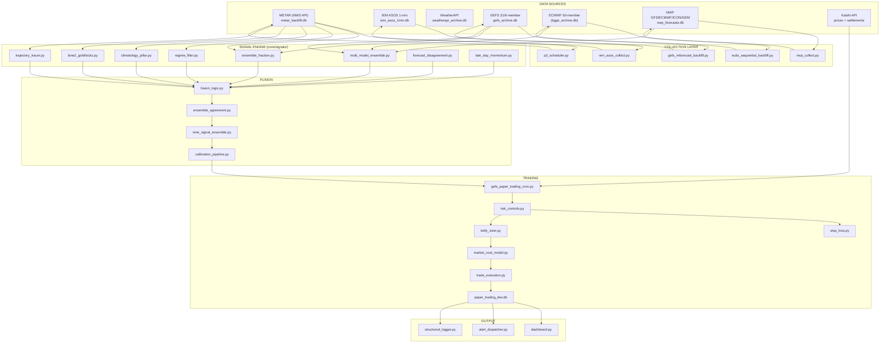

# Weather Engine — Application Map, Module Glossary & Wiring Status

**Generated:** 2026-08-04 23:50 UTC
**Method:** AST import analysis of 149 core modules + session knowledge
**Note:** graphify knowledge graph blocked on OpenAI credits (429). This doc is the structural map.

---

## 1. APPLICATION FLOWCHART

---

## 2. WIRED-UP CORE PIPELINE (Active)

| Module | Role | Wired? |
|--------|------|--------|
| `p3_scheduler.py` | Orchestrates METAR/epoch collection | ✅ Active |
| `p3_main.py` | Main entry, wires scheduler + signals | ✅ Active |
| `p3_api.py` | Flask API endpoints | ✅ Active |
| `p3_feature_extractor.py` | Extracts epoch features | ✅ Active |
| `p3_match_engine.py` | Analog epoch matching | ✅ Active |
| `p3_trajectory_tracer.py` | Forward trajectory from matches | ✅ Active (as pattern helper) |
| `ensemble_fraction.py` | GEFS 31-member directional probability | ✅ Active |
| `risk_controls.py` | Loss/drawdown/consecutive-loss limits | ✅ Active (in cron) |
| `stop_loss.py` | Loss cap, 30-day, win-rate stop | ✅ Active (in cron) |
| `market_cost_model.py` | Kalshi fee + spread + slippage | ✅ Active |
| `kalshi_monitor.py` | Kalshi API price feed + auth | ✅ Active |
| `db_connection.py` | Centralized DB registry | ✅ Active (underused) |
| `gefs_paper_trading_cron.py` (script) | Paper trading loop | ⏸️ Paused (cleanup) |

## 3. NOT WIRED UP (Orphaned / Experimental)

### Signal modules (built, not connected)
| Module | What it does | Why not wired |
|--------|--------------|---------------|
| `lane2_goldilocks.py` | Fleeting temp-tick alerts at bucket boundaries | Gray Room pending |
| `goldilocks_predictive.py` | Goldilocks ML variant | Killed Aug 3, reverted |
| `forecast_disagreement.py` | GFS vs ECMWF disagreement signal | Needs Edge 20 |
| `late_day_momentum.py` | Late-day temp momentum | KILLED (48% acc) |
| `late_day_momentum_hourly.py` | Hourly variant | KILLED (48% acc) |
| `multi_model_ensemble.py` | Edge 20 multi-model (GFS/ECMWF/ICON/GEM) | NWP ready, not wired |
| `nine_signal_ensemble.py` | 9-signal fusion | Needs calibration |
| `climatology_pillar.py` | Seasonal climatology baseline | Standalone |
| `rdae_mos.py` | Analog ensemble + MOS (Edge 2) | Gray Room round 3 |
| `cloud_cover_modulation.py` | Cloud cover temp modulation | PARK |
| `dewpoint_modulator.py` | Dewpoint ceiling cap | PARK |
| `enso_regime_bias.py` | ENSO regime bias | PARK |
| `radiational_cooling.py` | Night cooling signal | PARK |
| `spread_momentum_signal.py` | Spread momentum | PARK |
| `time_decay.py` | Forecast time decay | Tested, not in ensemble |
| `round_number_anchoring.py` | Price anchor effects | PARK |
| `liquidity_weighted_ensemble.py` | Liquidity-weighted fusion | PARK |
| `low_liquidity_traps.py` | Low-liquidity detection | PARK |
| `station_rank_selective.py` | Station skill ranking | PARK |
| `seasonal_diurnal_curve.py` | Seasonal diurnal calibration | PARK |

### Trading/execution helpers (standalone)
| Module | What it does | Status |
|--------|--------------|--------|
| `trade_execution.py` | Order execution | Not in cron path |
| `live_trader.py` / `live_trading_loop.py` | Live trading | Not wired (paper only) |
| `intraday_trading_loop.py` | Intraday loop | Not wired |
| `scaling_ladder.py` | Position scaling | PARK |
| `buy_side_optimizer.py` | Buy-side contract selection | PARK |
| `contract_selection_optimizer.py` | Contract selection | PARK |
| `strike_selector.py` | Strike selection | PARK |
| `position_sizer.py` | Position sizing | PARK |
| `multi_stage_execution.py` | Multi-stage execution | PARK |
| `risk_budget.py` | Risk budget allocation | PARK |

### Alert/observability (Phase B, partially wired)
| Module | What it does | Status |
|--------|--------------|--------|
| `alert_builder.py` | Builds alert objects | Orphaned |
| `alert_formatter.py` | Formats alerts (has fee bug) | Orphaned |
| `alert_dispatcher.py` | Sends alerts | Orphaned |
| `alert_state_machine.py` | Alert lifecycle | Orphaned |
| `alert_throttle.py` | Alert rate limiting | Orphaned |
| `alert_reconciliation.py` | Alert reconciliation | Orphaned |
| `alert_integrity_monitor.py` | Alert integrity | Orphaned |
| `alert_retry_queue.py` | Alert retry | Orphaned |
| `authoritative_state.py` | Runtime authority snapshot | Orphaned |
| `visibility_hooks.py` | Visibility hooks | Orphaned |
| `observability.py` | Observability | Orphaned |
| `health_monitor.py` / `healthbeat_monitor.py` | Health checks | Orphaned |
| `data_freshness.py` / `data_freshness_monitor.py` | Data freshness | Orphaned |
| `disk_monitor.py` | Disk usage | Orphaned |
| `confidence_dashboard.py` / `calibration_dashboard.py` | Dashboards | Orphaned |

### Backtest/validation (standalone)
| Module | What it does | Status |
|--------|--------------|--------|
| `p3_backtest_engine.py` | Backtest engine | Standalone |
| `p3_backtest_engine_v2.py` | Analog backtest v2 | FAILED (32% acc) |
| `unified_backtest.py` | Unified backtest | Standalone |
| `replay_engine.py` | Deterministic replay | Orphaned |
| `replay_parity_validator.py` | Replay parity check | Orphaned |
| `near_miss_audit.py` | Near-miss audit | Orphaned |
| `calibration_pipeline.py` / `rolling_calibration.py` | Calibration | Orphaned |
| `spread_calibrator.py` | Spread calibration | Orphaned |

### Data collection (standalone services)
| Module | What it does | Status |
|--------|--------------|--------|
| `data_collector.py` | Generic data collection | Orphaned |
| `weather_collector_service.py` | Weather collection service | Orphaned |
| `market_monitor.py` | Market monitoring | Orphaned |
| `order_book_collector.py` | Order book collection | Orphaned |
| `order_book_baseline.py` | Order book baseline | Orphaned |
| `polymarket_whale_db.py` / `whale_watch_db.py` | WhaleWatch DB | Orphaned |
| `whale_detector.py` / `whale_signal_feeder.py` | Whale detection | Orphaned |
| `whale_goldilocks_fusion.py` | Whale+Goldilocks fusion | Orphaned |

### Governance/duplicate config
| Module | What it does | Status |
|--------|--------------|--------|
| `instance_config_fixed.py` | Config variant | Duplicate |
| `instance_config_test_write.py` | Config experiment | Duplicate |
| `db_schema.py` | Schema definitions | Orphaned |
| `compatibility_checks.py` | Compatibility | Orphaned |
| `security_boundaries.py` | Security | Orphaned |
| `production_gate.py` | Production gate | Orphaned |
| `settlement_cascade.py` / `settlement_processor.py` | Settlement handling | Orphaned |
| `kalshi_calendar.py` | Kalshi calendar | Orphaned |
| `polymarket_kalshi_feeder.py` | Cross-platform feeder | Orphaned |

---

## 4. SIGNAL REGISTRY (wiring status)

| Signal | Source | Wired? | Status |
|--------|--------|--------|--------|
| Ensemble Fraction | GEFS 31-member | ✅ | ACTIVE |
| Regime Filter | METAR pattern | ✅ | ACTIVE (in cron path) |
| Directional (mean-threshold) | GEFS | ✅ | ACTIVE |
| Goldilocks | ASOS 1-min | ❌ | Gray Room pending |
| Trajectory | Analog epochs | ⚠️ | Helper lane, not gate |
| Disagreement | GFS vs ECMWF | ❌ | Needs Edge 20 |
| Multi-model (Edge 20) | NWP 4 models | ❌ | Data ready, not wired |
| Late-day momentum | METAR | ❌ | KILLED 2026-07-06 |
| RDAE-MOS | Analog+MOS | ❌ | PARK |
| Climatology | Seasonal | ⚠️ | Standalone baseline |
| Dewpoint cap | METAR | ❌ | PARK |
| Cloud modulation | METAR/NWP | ❌ | PARK |
| ENSO regime | Climate | ❌ | PARK |
| Time decay | — | ⚠️ | Tested, not in ensemble |

---

## 5. RECOMMENDED NEXT STEPS

1. **Fix alert_formatter fee bug** (CRITICAL, 1 line)
2. **Unify fee model** in market_cost_model.py
3. **Wire Edge 20** (multi-model NWP) — data is ready
4. **Gray Room** → trajectory + goldilocks lanes
5. **Signal registry manifest** + wiring status (this doc as base)
6. **Archive experiments** to scripts/archive/ (keep, don't delete)
7. **Bonus credits** for OpenAI → re-run graphify for the knowledge graph